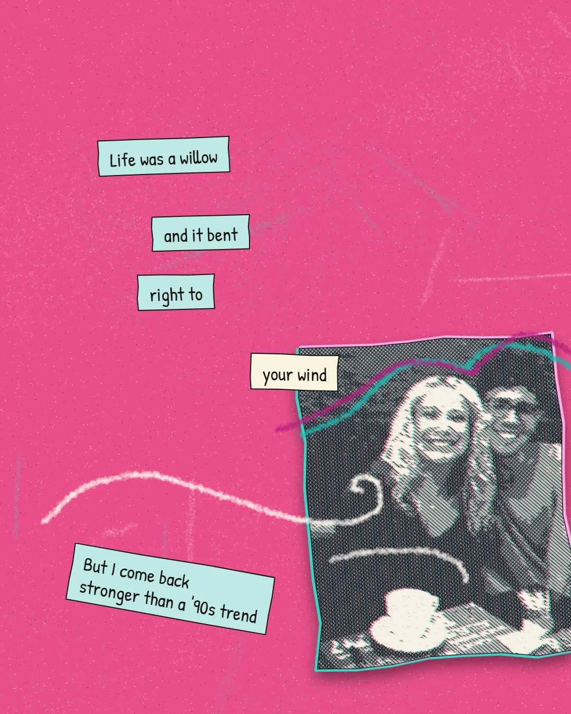
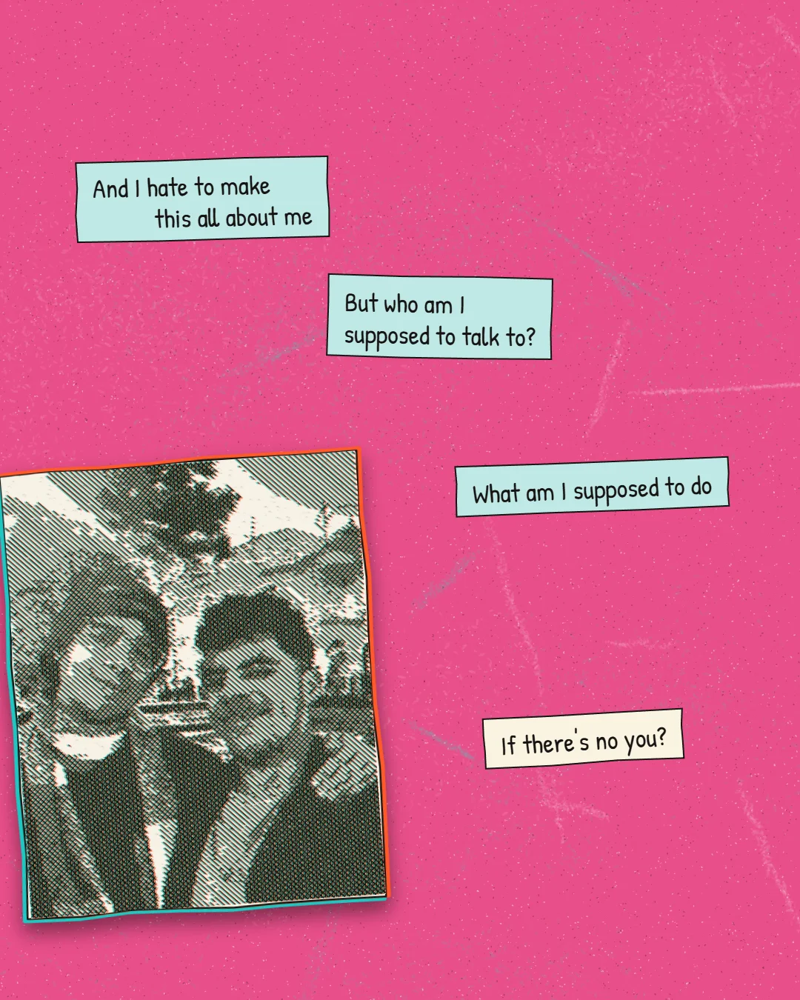
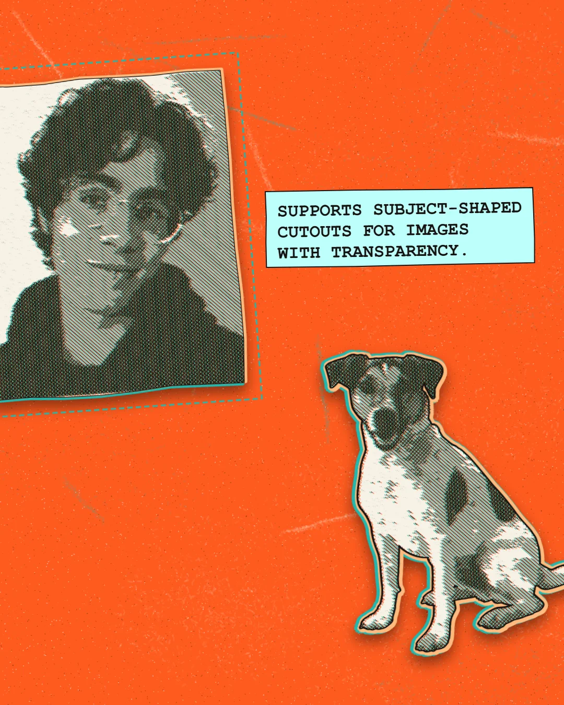

# xerox-collage-editor

🇺🇸 [Read in English](README.md)

Editor de colagens no estilo "xerox/recorte de papel": fotos com hachura p&b, franja cromática, molduras recortadas, frases-adesivo, giz e um modo mural com folhas lado a lado. Roda 100% no navegador, sem build — é só abrir o `index.html`.

## Recursos

- Tamanho de tela customizável (presets ou largura/altura manuais), valendo para todas as folhas do carrossel.
- Recorte de foto em dois modos: moldura de papel serrilhada, ou máscara recortada no formato do assunto (usa o canal alfa do PNG pra traçar a silhueta).
- Carrossel contínuo de fundo: estica uma foto como fundo por várias folhas, seja como sangria total ou como faixa rasgada flutuando sobre a pintura de fundo.
- Gerador de fundo pintado com paleta, intensidade de respingos e granulado ajustáveis.
- Efeito p&b hachurado com densidade, contraste, brilho, granulado e franja cromática ciano/laranja ajustáveis.
- Frases-adesivo com fonte, alinhamento, cor (predefinida ou personalizada), rotação e suporte a upload de fonte própria (`.ttf`/`.otf`/`.woff`).
- Giz para rabiscar com espessura e cor ajustáveis, e desfazer/refazer (também via `Ctrl+Z` / `Ctrl+Y`).
- Gerenciamento de múltiplas folhas (adicionar/excluir, navegar por abas), independente do modo mural.
- Modo mural: coloca as folhas lado a lado e permite arrastar fotos recortadas ou um fundo contínuo livremente entre as divisões.
- Upload de fotos HEIC/HEIF com conversão automática pra JPEG no navegador (veja a nota abaixo).
- Exportação da folha atual ou de todas as folhas de uma vez, em PNG.

## Estrutura

```
.
├── index.html                        # estrutura da página (sidebar + stage)
├── css/
│   └── style.css                     # todo o visual
└── js/
    ├── 01-setup-paletas-fontes.js    # canvas, favicon, presets de tamanho, paletas, fontes
    ├── 02-utils-estado.js            # RNG, helpers de textura/cor, estado global (settings, folhas)
    ├── 03-render-pipeline.js         # hachura, recorte de foto, carrossel contínuo, fundo, stickers, giz, paint principal
    ├── 04-folhas-upload-ui.js        # abas de folha, lista de fotos, upload, carrossel contínuo
    ├── 05-modo-mural.js              # folhas lado a lado com rolagem contínua
    ├── 06-controles-ui.js            # moldura, sliders, UI de frases e de giz
    ├── 07-interacao-download.js      # arraste no canvas + exportação PNG
    └── 08-init.js                    # cria a primeira folha e renderiza
```

Os módulos JS são carregados como `<script>` clássicos, na ordem acima, e dividem o mesmo escopo global — é exatamente o mesmo comportamento do arquivo único original, só reorganizado por responsabilidade para ficar mais fácil de navegar e editar.

## Exemplos

<p align="center">
  
  
  
</p>

## Rodando localmente

Como os scripts usam apenas APIs de canvas/DOM, basta abrir o `index.html` direto no navegador. Se preferir servir por HTTP (recomendado para evitar bloqueios de `file://` em alguns navegadores):

```bash
python3 -m http.server 8000
# depois abra http://localhost:8000
```

### Nota sobre upload de HEIC/HEIF

Não há build nem dependências empacotadas no projeto. A única exceção: ao enviar uma foto `.heic`/`.heif`, o app carrega sob demanda a biblioteca [heic2any](https://github.com/alexcorvi/heic2any) via CDN (`cdn.jsdelivr.net`) pra converter a foto pra JPEG. Isso só acontece nesse upload específico e exige conexão com a internet; todo o resto funciona 100% offline depois que a página carrega.

## Publicando no GitHub Pages

1. Suba este repositório no GitHub.
2. Em *Settings → Pages*, selecione a branch principal e a pasta raiz (`/`).
3. O app fica disponível em `https://<usuario>.github.io/<repo>/`.

## Licença

Este projeto está sob a licença MIT. Veja o arquivo [LICENSE](LICENSE) para mais detalhes.
